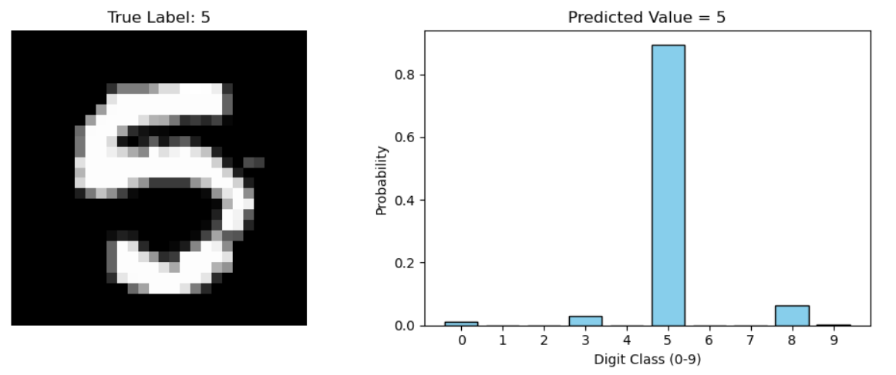
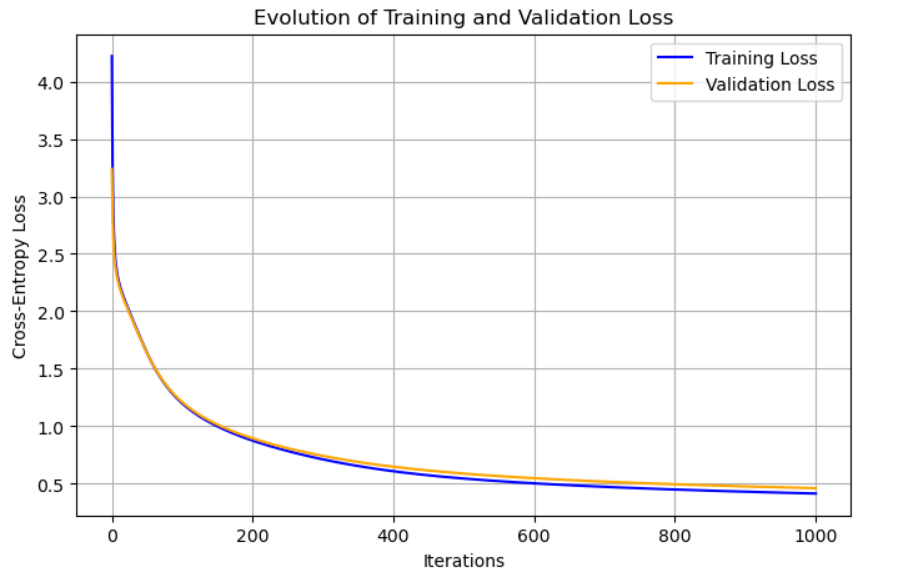
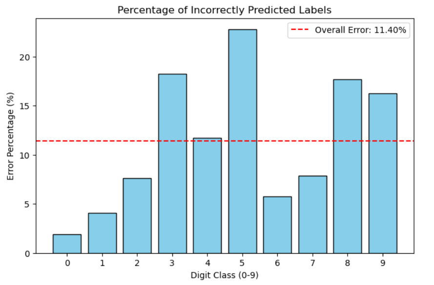
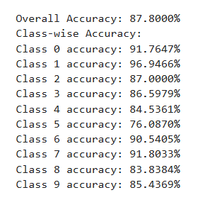
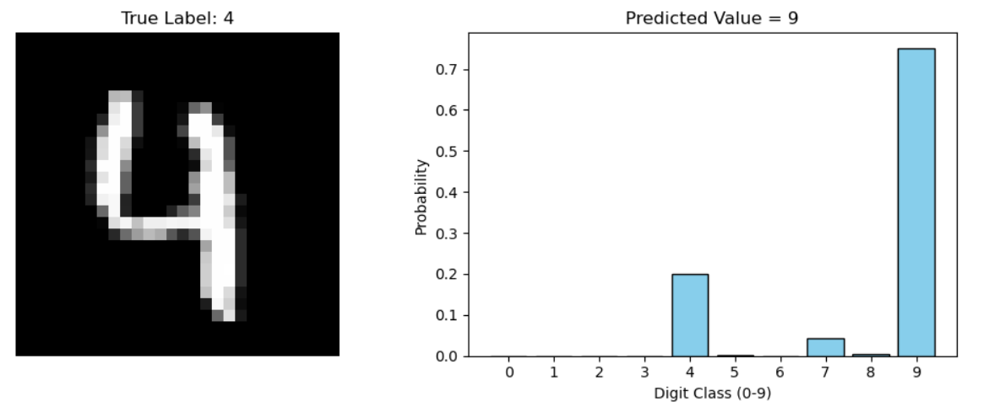

# My First Neural Network Implementations from the Ground Up  

## Presentation and Dependencies  
This repository contains multiple implementations of simple feedforward neural networks for the **MNIST handwritten digit recognition task**.  
All models are written from scratch using only:  
- [NumPy](https://numpy.org/) for matrix operations  
- [Pandas](https://pandas.pydata.org/) for loading the dataset  
- [Matplotlib](https://matplotlib.org/) for visualization  

No deep learning frameworks (TensorFlow, PyTorch, Keras) are used.  
The goal is to **understand the internal mechanics** of neural networks: forward propagation, backpropagation, loss computation, and weight updates using gradient descent.  

The networks are trained on the **Kaggle MNIST dataset** (`train.csv` and `test.csv`).  

Here are some MNIST sample images:  

  

---

## Implemented Models  
1. **Basic Network (784 → 10 → 10)**  
   - Input layer: 784 (28x28 flattened pixels)  
   - Hidden layer: 10 nodes, ReLU activation  
   - Output layer: 10 nodes, Softmax activation  
   - Loss: Cross-entropy
   - Parameter Initialization: Uniform random values in [-0.5, 0.5]  
   - Optimizer: Batch Gradient Descent (BGD)  

2. **Extended Network (784 → 128 → 64 → 10)**  
   - Input layer: 784 (28x28 flattened pixels)  
   - Hidden Layer 1: 128 nodes, ReLU activation  
   - Hidden Layer 2: 64 nodes, ReLU activation  
   - Output layer: 10 nodes, Softmax activation  
   - Loss: Cross-entropy 
   - Parameter Initialization: He Initialization (scaled Gaussian, √(2/fan_in))  
   - Optimizer: Adam Optimizer (adaptive learning rate with momentum and RMSProp) 

  

Example output of a trained model predicting a random test digit:  

  

---

## Evaluation and Results  
1. **Loss Curves**  
   During training, **training loss** and **validation loss** are tracked for every iteration.  
   These curves help visualize learning progress and detect overfitting.  

   

2. **Error Distribution Across Classes**  
   A bar chart is generated showing the **percentage of errors for each digit class (0–9)**.  
   A red line indicates the overall error rate.  

   

3. **Per-Class Accuracy and Overall Accuracy**  
   Alongside graphs, plain text reports show:  
   - Overall accuracy  
   - Accuracy for each digit class (0–9)  
   
---

## Usage Guide  
1. **Training the Network**  
   Run the training function (`gradient_descent_with_losses`) to train the neural network.  
   Training runs for a fixed number of iterations with gradient descent weight updates.  

2. **Testing on Random Digits**  
   Use `test_random_prediction` to:  
   - Show a random test digit  
   - Display class probability distribution    

   Example output:  

     

3. **Error Analysis**  
   - Run `plot_class_errors_nn` to see class-wise error rates.  
   - Run `print_model_accuracy` for plain-text accuracy reports.  

4. **Customization**  
   - Learning rate, number of iterations, and hidden layer sizes can be easily adjusted in the code.  
   - Try different architectures and compare results.  

---

## Structure of the Code  
- **digit_recognizer.py** – Basic 2-layer neural network (784x10x10)  
- **digit_recognizer2.py** – Extended 3-layer neural network (784x128x64x10)  
- **utils/** – Helper functions (loss plotting, error analysis, visualization)  
- **notebooks/** – Jupyter notebooks for step-by-step experiments  
- **data/** – MNIST dataset (`train.csv`, `test.csv`)  

---

## Future Improvements  
- Implement **mini-batch gradient descent** for efficiency  
- Add **regularization (L2 / dropout)** to reduce overfitting  
- Experiment with different activation functions (Sigmoid, Tanh, LeakyReLU)  
- Extend to **Convolutional Neural Networks (CNNs)** for higher accuracy  
